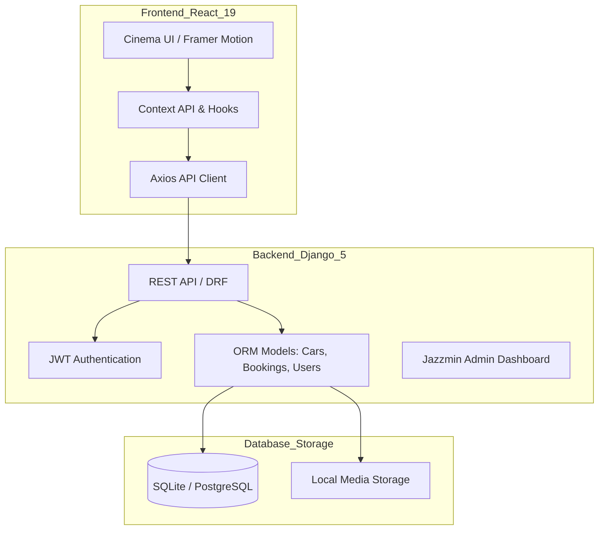

# 💎 RIDELUX — Ultra-Premium Car Rental Platform 🚀

[](https://www.djangoproject.com/)
[](https://reactjs.org/)
[](https://tailwindcss.com/)
[](https://www.framer.com/motion/)
[](https://uz.wikipedia.org/wiki/O%CA%BBzbekcha)

**RIDELUX** — bu O'zbekistonning premium segmenti uchun mo'ljallangan, o'ta zamonaviy va yuqori texnologiyali avtomobil ijarasi ekotizimi. Platforma "Studio Minimalist" estetikasida yaratilgan bo'lib, har bir detal premium foydalanuvchi tajribasini (UX) ta'minlashga yo'naltirilgan.

---

## 🏗️ Tizim Arxitekturasi (System Architecture)



---

## 🔥 Loyihaning Eng So'nggi Yangiliklari

### 🚗 33 ta Eksklyuziv Model (Database-Driven)
*   **33 ta to'liq yangilangan model**: Har bir avtomobil (BMW, Mercedes, Porsche, BYD, Chevrolet, va b.) o'zining noyob texnik ko'rsatkichlari (HP, Top Speed, Acceleration) bilan bazaga kiritilgan.
*   **Dynamic Car Detail**: Barcha ma'lumotlar — texnik spec'lardan tortib, marketing matnlarigacha (Rear View, Interior descriptions) to'liq API orqali keladi.

### 👔 Professional Chauffeur Service
*   **Haydovchi bilan xizmat ko'rsatish**: VIP mijozlar uchun alohida, professional tarzda dizayn qilingan Chauffeur sahifasi.
*   **Generate qilingan premium aktivlar**: Loyiha uchun maxsus yaratilgan yuqori sifatli vizual kontent.

### ⚡ Elektro Inqilobi (EV Fleet)
*   **Yashil kelajak**: BYD va Tesla modellarining eng so'nggi versiyalari (Seal, Han, Plaid) uchun maxsus, elektromobillarga moslashtirilgan interfeys.

---

## 🗺️ Loyiha Yo'l Xaritasi (Roadmap)

### ✅ Phase 1: MVP & Core Features (Completed)
- [x] JWT Autentifikatsiya tizimi.
- [x] 33 ta premium model bazasi.
- [x] Dinamik Car Detail va Spec'lar.
- [x] Chauffeur sahifasi va vizual aktivlar.

### 🚧 Phase 2: User Experience & Optimization (Current)
- [ ] Onlayn to'lov tizimini integratsiyasi (Payme/Click).
- [ ] Foydalanuvchi hujjatlarini avtomatik tekshirish (AI OCR).
- [ ] Telegram Bot orqali buyurtma bildirishnomalari.

### 🚀 Phase 3: Scaling (Future)
- [ ] Mobil ilova (React Native).
- [ ] Boshqa shaharlar (Samarqand, Buxoro) uchun kengaytma.
- [ ] Avto-parkni boshqarish uchun dashboard (Owner Panel).

---

## 📦 O'rnatish va Ishga tushirish

### 1. Backend (API & Admin)
```powershell
cd backend
python -m venv venv
.\venv\Scripts\activate # Windows
# source venv/bin/activate # Mac/Linux

pip install -r requirements.txt
python manage.py makemigrations
python manage.py migrate
python scripts/seed_extended.py # 🚀 Ma'lumotlarni yuklash
python manage.py runserver
```

### 2. Frontend (UI)
```powershell
cd frontend
npm install
npm run dev
```

---

**RIDELUX — Drive Your Status.** 💎