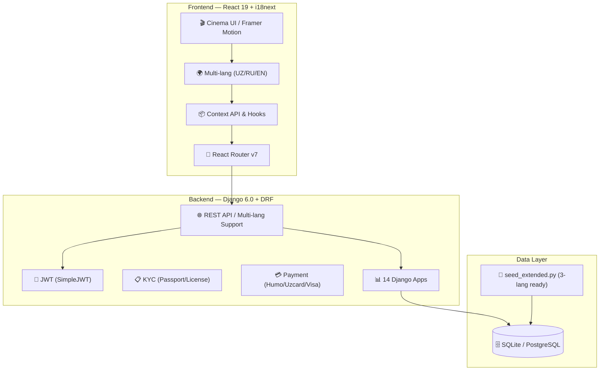

# 💎 RENTAL CAR — Ultra-Premium Car Rental Platform (Global Edition)

[](https://www.djangoproject.com/)
[](https://reactjs.org/)
[](https://rentalcar.uz)
[](https://tailwindcss.com/)
[](https://www.framer.com/motion/)

**RENTAL CAR** — O'zbekistonning premium segmenti uchun mo'ljallangan, to'liq **3 tilda (O'zbek, Rus, Ingliz)** ishlovchi o'ta zamonaviy avtomobil ijarasi platformasi. "Cinema UI" estetikasida yaratilgan bo'lib, xalqaro mijozlar va lokal premium segment uchun 33 ta eksklyuziv model, VIP haydovchi xizmati, onlayn to'lov va to'liq KYC verifikatsiyani taqdim etadi.

---

## 🌍 Multi-Language Localization (i18n)

Platforma endi xalqaro bozorga to'liq tayyor:
- **UZ/RU/EN** — Barcha sahifalar, modallar, xabarnomalar va tilga mos narx formatlari (`so'm` / `сум` / `UZS`).
- **Dinamik Tarjima** — `react-i18next` orqali real vaqtda til almashtirish.
- **Admin Panel** — Operatorlar va menejerlar uchun ham to'liq 3 tilli boshqaruv interfeysi.

---

## 🏗️ Tizim Arxitekturasi



---

## 📱 Platformaning Sahifalari

| Sahifa | Fayl | Tavsif |
|---|---|---|
| 🏠 **Bosh Sahifa** | `Home.jsx` | Hero slider, Til tanlash, Premium xizmatlar |
| 🚗 **Katalog** | `Fleet.jsx` | 33 ta model, 3 tilli tavsiflar, solishtirish |
| 🛡️ **Checkout** | `Checkout.jsx` | 5 ta qadamli bron pipeline + OTP (3 tilli) |
| 👨‍✈️ **Chauffeur** | `Chauffeur.jsx` | VIP haydovchi xizmati uchun maxsus bron shakli |
| 👤 **Profile** | `Profile.jsx` | Hujjatlar, Buyurtmalar tarixi, Kartalar boshqaruvi |
| ⚙️ **Admin** | `AdminPanel.jsx` | CRM, Moliya, KYC verifikatsiya va Dashbord |

---

## 👑 Global Admin Control
Yangi Admin Panel operatorlarga quyidagi imkoniyatlarni beradi:
- **CRM Dashboard**: Foydalanuvchilarning real-time statusi va KYC holati.
- **Financial Analytics**: Tushumlar grafigi va tranzaksiyalar filteri.
- **Fleet Management**: Avtomobillar holati (Available / Rented / Maintenance).
- **Localized UI**: Admin panel to'liq O'zbek, Rus va Ingliz tillarida.

---

## 📦 O'rnatish

### 1. Backend
```powershell
pip install -r requirements.txt
python manage.py migrate
python scripts/seed_extended.py --fresh  # 🌱 3 tilli demo ma'lumotlar
python manage.py runserver
```

### 2. Frontend
```powershell
npm install
npm run dev
```

---

## 🛠️ Texnologiyalar (Yaralangan stack)
- **Frontend**: React 19, i18next, Framer Motion, Tailwind 4, Recharts, Lucide.
- **Backend**: Django 6.0, DRF, JWT, Spectacular (Swagger), Pillow.
- **Arxitektura**: 14 ta mustaqil Django app, Professional Seed tizimi.

---

<div align="center">

### 💎 Rental Car — Your Global Premium Ride.

**© 2026 RENTAL CAR. Global Platform for Premium Mobility.**

</div>
| `POST` | `/api/users/register/` | Ro'yxatdan o'tish |
| `POST` | `/api/users/login/` | Kirish (JWT) |
| `GET` | `/api/users/me/` | Joriy foydalanuvchi |
| `GET` | `/api/cars/` | Mashinalar ro'yxati (filtr, qidiruv) |
| `GET` | `/api/cars/{slug}/` | Mashina detali |
| `POST` | `/api/bookings/` | Yangi buyurtma |
| `GET` | `/api/bookings/my/` | Mening buyurtmalarim |
| `POST` | `/api/payments/initiate/` | To'lov boshlash |
| `POST` | `/api/payments/verify-otp/` | OTP tasdiqlash |
| `GET/POST` | `/api/users/kyc/` | KYC profil |
| `GET` | `/api/users/notifications/` | Bildirishnomalar |
| `GET` | `/api/loyalty/account/` | Loyalty ma'lumotlari |
| `GET` | `/api/insurance/plans/` | Sug'urta paketlari |
| `POST` | `/api/contact/` | Aloqa xabari |

---

<div align="center">

### 💎 RENTAL CAR — Drive Your Status.

*Premium avtomobil ijarasi platformasi — O'zbekiston uchun yaratilgan.*

**© 2026 RENTAL CAR. Barcha huquqlar himoyalangan.**

</div>