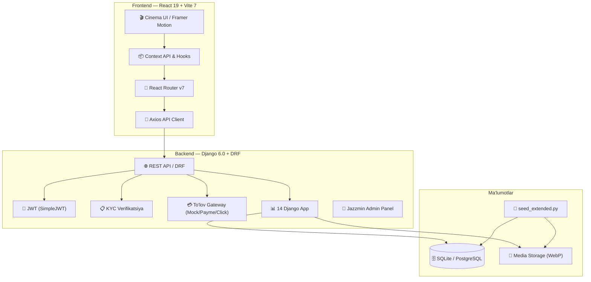

# 💎 RIDELUX — Ultra-Premium Car Rental Platform

[](https://www.djangoproject.com/)
[](https://reactjs.org/)
[](https://tailwindcss.com/)
[](https://www.framer.com/motion/)
[](https://vitejs.dev/)
[](https://uz.wikipedia.org/wiki/O%CA%BBzbekcha)

**RIDELUX** — O'zbekistonning premium segmenti uchun mo'ljallangan, o'ta zamonaviy va yuqori texnologiyali avtomobil ijarasi platformasi. "Studio Minimalist" estetikasida yaratilgan bo'lib, har bir detal premium foydalanuvchi tajribasini ta'minlashga yo'naltirilgan. **33 ta eksklyuziv model**, to'liq KYC verifikatsiya, onlayn to'lov, sug'urta, loyalty dasturi va professional haydovchi xizmati.

---

## 🏗️ Tizim Arxitekturasi



---

## 📱 Platformaning Sahifalari

| Sahifa | Fayl | Tavsif |
|---|---|---|
| 🏠 **Bosh Sahifa** | `Home.jsx` | Hero section, Statistika, Premium slider, Xarita |
| 🚗 **Avtomobillar** | `Fleet.jsx` | 33 ta model, filtrlar, qidiruv, taqqoslash |
| 🔍 **Mashina Detali** | `CarDetail.jsx` | Texnik spec, galereya, buyurtma, sug'urta |
| 🛒 **Checkout** | `Checkout.jsx` | 5-bosqichli buyurtma + OTP to'lov |
| ⚡ **Elektromobillar** | `ElectricCars.jsx` | EV fleet (Tesla, BYD, Porsche, BMW, Kia) |
| 👔 **Haydovchi Xizmati** | `Chauffeur.jsx` | VIP transfer, aeroport xizmati |
| 👤 **Profil** | `Profile.jsx` | KYC, buyurtmalar, to'lovlar, kartalar, xavfsizlik |
| 🔑 **Kirish / Ro'yxat** | `SignIn.jsx` / `SignUp.jsx` | JWT autentifikatsiya |
| ⚙️ **Admin Panel** | `AdminPanel.jsx` | Buyurtmalar, foydalanuvchilar, mashinalar boshqaruvi |
| 📬 **Aloqa** | `Contact.jsx` | Aloqa formasi, xarita |
| ❓ **FAQ** | `FAQ.jsx` | Ko'p beriladigan savollar |
| 📄 **Shartlar** | `Terms.jsx` | Foydalanish shartlari |
| ℹ️ **Biz Haqimizda** | `AboutUs.jsx` | Kompaniya haqida |
| 🔄 **Taqqoslash** | `Compare.jsx` | Mashinalarni taqqoslash |

---

## 🗃️ Backend Modullari (14 Django App)

```
apps/
├── 👤 users/           — User model, Notification, KYCProfile
├── 🚗 cars/            — CarModel, Car (unit), Amenity, CarImage, MaintenanceRecord
├── 📋 bookings/        — Booking, Fine, Waitlist
├── 💳 payments/        — PaymentMethod, Transaction, Invoice, Receipt, Promo, Deposit, Refund
├── ⭐ reviews/          — Review (user↔car unique)
├── ❤️ favorites/       — Favorite (user↔car unique)
├── 🏆 loyalty/         — LoyaltyTier, LoyaltyAccount, LoyaltyTransaction
├── 🛡️ insurance/       — InsurancePlan, BookingInsurance
├── 📍 districts/       — District (GPS koordinatalar bilan)
├── 🔧 maintenance/     — MaintenanceType, MaintenanceRecord
├── 💲 pricing/         — PricingRule (dinamik narxlash)
├── 📬 contact/         — ContactMessage
├── 👑 admin_panel/     — Custom admin API endpoints
└── 📄 ...config/       — Settings, URLs, CORS, JWT config
```

---

## 🚗 Avtomobil Parki — 33 ta Premium Model

| # | Brend | Model | Kategoriya | Ot Kuchi | Narx (kunlik) |
|---|---|---|---|---|---|
| 1 | BMW | iX xDrive50 | ⚡ Elektro | 523 HP | 1,200,000 |
| 2 | BMW | M5 F90 CS | 🏎️ Premium | 627 HP | 2,875,000 |
| 3 | BMW | X7 M60i | 🚙 SUV | 530 HP | 3,450,000 |
| 4 | BYD | Atto 3 | ⚡ Elektro | 201 HP | 700,000 |
| 5 | BYD | Chazor | ⚡ Elektro | 197 HP | 550,000 |
| 6 | BYD | Han EV | ⚡ Elektro | 517 HP | 900,000 |
| 7 | BYD | Seal | ⚡ Elektro | 530 HP | 850,000 |
| 8 | BYD | Song Plus | 🚙 SUV | 197 HP | 750,000 |
| 9 | Chevrolet | Cobalt | 🚘 Sedan | 105 HP | 350,000 |
| 10 | Chevrolet | Gentra | 🚘 Sedan | 107 HP | 350,000 |
| 11 | Chevrolet | Malibu 2 | 🏎️ Premium | 253 HP | 750,000 |
| 12 | Chevrolet | Malibu 1 | 🚘 Sedan | 167 HP | 400,000 |
| 13 | Chevrolet | Onix | 🚘 Sedan | 132 HP | 450,000 |
| 14 | Chevrolet | Spark | 💰 Economy | 85 HP | 250,000 |
| 15 | Chevrolet | Tahoe | 🚙 SUV | 355 HP | 2,000,000 |
| 16 | Chevrolet | Tracker 2 | 🚙 SUV | 137 HP | 450,000 |
| 17 | Chevrolet | Traverse | 🚙 SUV | 281 HP | 1,500,000 |
| 18 | Hyundai | Santa Fe | 🚙 SUV | 281 HP | 1,000,000 |
| 19 | Hyundai | Sonata | 🚘 Sedan | 191 HP | 700,000 |
| 20 | Hyundai | Tucson | 🚙 SUV | 187 HP | 750,000 |
| 21 | Kia | Carnival | 🚙 SUV | 290 HP | 1,200,000 |
| 22 | Kia | EV6 | ⚡ Elektro | 325 HP | 950,000 |
| 23 | Kia | K5 | 🚘 Sedan | 191 HP | 650,000 |
| 24 | Kia | Sonet | 🚙 SUV | 115 HP | 450,000 |
| 25 | Kia | Sorento | 🚙 SUV | 281 HP | 950,000 |
| 26 | Mercedes-Benz | G63 AMG | 🏎️ Premium | 585 HP | 5,000,000 |
| 27 | Mercedes-Benz | S-Class W223 | 🏎️ Premium | 429 HP | 4,500,000 |
| 28 | Porsche | Cayenne Coupe | 🏎️ Premium | 335 HP | 3,500,000 |
| 29 | Porsche | Taycan Turbo S | ⚡ Elektro | 750 HP | 4,000,000 |
| 30 | Tesla | Model S Plaid | ⚡ Elektro | 1020 HP | 3,000,000 |
| 31 | Tesla | Model Y | ⚡ Elektro | 384 HP | 900,000 |
| 32 | Toyota | Camry 75 | 🚘 Sedan | 203 HP | 650,000 |
| 33 | Toyota | Land Cruiser 300 | 🚙 SUV | 409 HP | 3,500,000 |

---

## 🔐 Autentifikatsiya va Xavfsizlik

- **JWT Token** — Access + Refresh token (SimpleJWT)
- **KYC Verifikatsiya** — 4 bosqichli: Passport (old/orqa), Haydovchilik guvohnomasi, Selfie
- **KYC Statuslari**: `draft` → `submitted` → `under_review` → `approved` / `rejected`
- **OTP To'lov Tasdiqi** — Simulated OTP for card payments
- **Role-based Access** — Admin, Staff, User, Corporate

---

## 💳 To'lov Tizimi

| Funksiya | Tavsif |
|---|---|
| **Payment Gateway** | Mock, Payme, Click adapterlari |
| **Karta Turlari** | Uzcard, Humo, Visa, Mastercard |
| **OTP Verifikatsiya** | Simulated 6-raqamli OTP tasdiqlash |
| **Invoice & Receipt** | Avtomatik hisob-faktura va kvitansiya |
| **Deposit Hold** | Garov puli ushlab turish / qaytarish |
| **Refund System** | Bekor qilingan buyurtmalar uchun qaytarish |
| **Promo Codes** | Foizli va belgilangan summa chegirmalari |

---

## 🏆 Loyalty Dasturi

| Daraja | Ball | Chegirma | Imtiyozlar |
|---|---|---|---|
| 🥉 Bronze | 0–999 | 0% | — |
| 🥈 Silver | 1,000–4,999 | 3% | Priority support |
| 🥇 Gold | 5,000–14,999 | 5% | Bepul sug'urta upgrade, bepul yetkazish |
| 💎 Platinum | 15,000+ | 10% | Barcha imtiyozlar |

---

## 🛡️ Sug'urta Paketlari

| Paket | Kunlik narx | Fransiza | Qoplama |
|---|---|---|---|
| Asosiy | 50,000 UZS | 5,000,000 | To'qnashuv |
| Standart | 100,000 UZS | 2,000,000 | + O'g'irlik, Yo'lda yordam |
| Premium | 200,000 UZS | 500,000 | + Tabiiy ofat, Shaxsiy |
| Elite VIP | 350,000 UZS | **0** | To'liq qoplama + 24/7 menejer |

---

## 💲 Dinamik Narxlash Qoidalari

- 📅 **Dam olish kunlari**: +15% (premium uchun +25%)
- ☀️ **Yozgi mavsum** (iyun–avgust): +20%
- ❄️ **Qishki mavsum** (dekabr–fevral): -10%
- 🎉 **Bayramlar** (Navro'z, Mustaqillik): +25–30%
- ⏰ **Oxirgi daqiqa** (1 kun oldin): -10%
- 📆 **Erta buyurtma** (14+ kun oldin): -5%
- 📅 **Uzoq ijara** (7+ kun): -8%, (14+ kun): -15%

---

## 🌱 Demo Ma'lumotlar (Seed System v3.0)

`seed_extended.py` — Bazadagi **barcha jadvallarni** professional demo data bilan to'ldiradi:

| Kategoriya | Soni | Tavsif |
|---|---|---|
| 👤 Users | 22 | Admin, Staff, User (approved/pending/rejected/draft/corporate/VIP) |
| 📋 KYC | 19 | 76 ta hujjat rasmi (passport, guvohnoma, selfie) |
| 💳 Payment Methods | 33 | Uzcard, Humo, Visa, Mastercard |
| 📋 Bookings | 53 | Barcha statuslar: pending → completed, chauffeur |
| 💰 Transactions | 42 | Mock, Payme, Click providerlari |
| 🧾 Invoices + Receipts | 27+27 | Avtomatik hisob-fakturalar |
| 🔔 Notifications | 79 | KYC, booking, payment, system xabarlari |
| 🏆 Loyalty | 19+65 | Accountlar va tranzaksiya tarixi |
| ⭐ Reviews | 46 | Har xil ratingli sharhlar |
| ❤️ Favorites | 55 | Tanlangan mashinalar |
| 🛡️ Insurance | 4+27 | Planlar va siyosatlar |
| 🎫 Promo Codes | 10 | Aktiv va muddati o'tgan kodlar |
| 🚗 Car Models | 33 | To'liq texnik spec'lar bilan |
| 🚙 Car Units | 101 | Turli statuslar (available, rented, maintenance) |
| 🖼️ Car Images | 165 | 5 ta slot per model (WebP) |
| 📍 Districts | 12 | Toshkent tumanlari (GPS koordinatlar) |
| 📬 Contact | 10 | Demo xabarlar |
| 🔧 Maintenance | 8+28 | Texnik xizmat turlari va yozuvlari |
| 💲 Pricing Rules | 10 | Dinamik narx qoidalari |
| 💸 Refunds | 8 | Qaytarish so'rovlari |
| ⏳ Waitlist | 22 | Kutish navbati |
| 🔒 Deposits | 27 | Garov pullari |

---

## 📦 O'rnatish va Ishga Tushirish

### Talablar

- Python 3.12+
- Node.js 18+
- npm 9+

### 1. Backend (API & Admin)

```powershell
cd backend

# Virtual environment
python -m venv venv
.\venv\Scripts\activate          # Windows
# source venv/bin/activate       # Mac/Linux

# Paketlarni o'rnatish
pip install -r requirements.txt

# Ma'lumotlar bazasini yaratish
python manage.py makemigrations
python manage.py migrate

# 🌱 Demo ma'lumotlarni yuklash
python scripts/seed_extended.py           # Incremental
python scripts/seed_extended.py --fresh   # To'liq tozalab qayta yuklash

# Serverni ishga tushirish
python manage.py runserver
```

### 2. Frontend (UI)

```powershell
cd frontend
npm install
npm run dev
```

### 3. URL'lar

| Xizmat | URL |
|---|---|
| 🌐 Frontend | http://localhost:5173 |
| 🔌 Backend API | http://127.0.0.1:8000/api/ |
| 👑 Admin Panel | http://127.0.0.1:8000/admin/ |
| 📚 API Docs | http://127.0.0.1:8000/api/schema/swagger/ |

---

## 🔑 Demo Foydalanuvchilar

| Emoji | Rol | Username | Parol | KYC Status |
|---|---|---|---|---|
| 👑 | Admin | `admin` | `admin123` | — |
| 🔧 | Staff | `staff_mod` | `staff123` | — |
| 🔧 | Staff | `staff_ali` | `staff123` | — |
| ✅ | User | `jamshid_car` | `demo123` | Approved |
| ✅ | User | `madina.lux` | `demo123` | Approved |
| ✅ | User | `sardor_88` | `demo123` | Approved |
| ✅ | User | `nilu_drive` | `demo123` | Approved |
| ✅ | User | `dilshod_pro` | `demo123` | Approved |
| ✅ | User | `shaxzoda.vip` | `demo123` | Approved |
| ✅ | User | `aziz_ride` | `demo123` | Approved |
| ✅ | User | `kamola_lux` | `demo123` | Approved |
| ⏳ | User | `anvar_taxi` | `demo123` | Submitted |
| ⏳ | User | `nodir.dev` | `demo123` | Under Review |
| ⏳ | User | `shahlo_2026` | `demo123` | Submitted |
| ❌ | User | `malika_queen` | `demo123` | Rejected |
| ❌ | User | `bobur_fail` | `demo123` | Rejected |
| 📋 | User | `feruza_lux` | `demo123` | Draft |
| 📋 | User | `otabek_new` | `demo123` | Draft |
| 🏢 | Corporate | `xurshid_b2b` | `demo123` | Approved |
| 🏢 | Corporate | `zarina_corp` | `demo123` | Approved |
| 💎 | VIP | `alisher_shark` | `demo123` | Approved (Platinum) |
| 🥇 | Gold | `bekzod_premium` | `demo123` | Approved (Gold) |

---

## 🛠️ Texnologiyalar

### Backend
| Paket | Versiya | Vazifa |
|---|---|---|
| Django | 6.0 | Web framework |
| DRF | 3.15+ | REST API |
| SimpleJWT | 5.3+ | JWT autentifikatsiya |
| django-cors-headers | 4.3+ | CORS boshqaruvi |
| django-filter | 23.5+ | API filtrlash |
| drf-spectacular | 0.27+ | OpenAPI/Swagger docs |
| Pillow | 10.0+ | Tasvir ishlov berish (WebP) |
| django-jazzmin | 3.0+ | Admin panel UI |
| payme-pkg | — | Payme gateway SDK |

### Frontend
| Paket | Versiya | Vazifa |
|---|---|---|
| React | 19 | UI framework |
| Vite | 7 | Build tool |
| Tailwind CSS | 4 | Utility-first CSS |
| Framer Motion | 12 | Animatsiyalar |
| GSAP | 3 | Murakkab animatsiyalar |
| React Router | 7 | Sahifalar navigatsiyasi |
| Axios | 1.7+ | HTTP client |
| Lucide React | — | Icon kutubxonasi |
| Recharts | 3 | Admin grafiklar |
| React Hook Form + Zod | — | Form validatsiya |
| Leaflet | 1.9+ | Interaktiv xarita |
| Swiper + Embla | — | Karusel/Slider |

---

## 📁 Loyiha Tuzilmasi

```
car-rental/
├── 📁 backend/
│   ├── apps/                    # 14 Django application
│   │   ├── users/               # User, Notification, KYCProfile
│   │   ├── cars/                # CarModel, Car, Amenity, CarImage
│   │   ├── bookings/            # Booking, Fine, Waitlist
│   │   ├── payments/            # Transaction, Invoice, Receipt, Promo
│   │   ├── reviews/             # Review
│   │   ├── favorites/           # Favorite
│   │   ├── loyalty/             # LoyaltyTier, Account, Transaction
│   │   ├── insurance/           # InsurancePlan, BookingInsurance
│   │   ├── districts/           # District (lat/lng)
│   │   ├── maintenance/         # MaintenanceType, MaintenanceRecord
│   │   ├── pricing/             # PricingRule
│   │   ├── contact/             # ContactMessage
│   │   └── admin_panel/         # Custom admin views
│   ├── config/                  # Settings, URLs
│   ├── scripts/
│   │   ├── seed_extended.py     # 🌱 Demo data generator v3.0
│   │   ├── car_definitions.py   # 33 ta model spec'lari
│   │   └── rentcar_images/      # Avtomobil rasmlari (WebP)
│   ├── media/                   # Yuklangan fayllar
│   └── requirements/            # base, dev, prod
│
├── 📁 frontend/
│   ├── src/
│   │   ├── pages/               # 18+ sahifa komponentlari
│   │   ├── components/          # Qayta foydalaniladigan UI
│   │   ├── context/             # Auth, Theme context
│   │   ├── hooks/               # Custom React hooks
│   │   ├── services/            # Axios API client
│   │   ├── utils/               # Yordamchi funksiyalar
│   │   └── data/                # Statik ma'lumotlar
│   └── package.json
│
└── README.md
```

---

## 🗺️ Loyiha Yo'l Xaritasi

### ✅ Phase 1: MVP & Core Features — Tugallandi
- [x] JWT Autentifikatsiya tizimi
- [x] 33 ta premium model bazasi (real texnik spec'lar)
- [x] Dinamik Car Detail va Spec'lar
- [x] Chauffeur sahifasi va vizual aktivlar
- [x] KYC 4-bosqichli verifikatsiya
- [x] 5-bosqichli Checkout pipeline
- [x] Admin Panel (buyurtmalar, foydalanuvchilar, mashinalar)

### ✅ Phase 2: Payment & Business Logic — Tugallandi
- [x] Mock Payment Gateway bilan to'lov
- [x] Payme va Click adapterlari
- [x] OTP verifikatsiya simulyatsiyasi
- [x] Invoice va Receipt generatsiyasi
- [x] Promo kod tizimi
- [x] Deposit hold/release mexanizmi
- [x] Refund so'rovlari
- [x] Loyalty points tizimi (4 daraja)
- [x] 4 ta sug'urta paketi
- [x] Dinamik narxlash (10 qoida)

### ✅ Phase 3: Full Data Ecosystem — Tugallandi
- [x] `seed_extended.py` v3.0 — to'liq baza to'ldirish
- [x] 22 ta demo foydalanuvchi (barcha rollar)
- [x] 101 ta avtomobil birligi (33 model)
- [x] Texnik xizmat yozuvlari
- [x] Kontakt xabarlari
- [x] Waitlist tizimi
- [x] 12 ta Toshkent tumani (GPS)

### 🚀 Phase 4: Production & Scaling — Kelajak
- [ ] Linux deployment (Gunicorn + Nginx + PostgreSQL)
- [ ] Telegram Bot orqali bildirishnomalar
- [ ] AI OCR — hujjatlarni avtomatik tekshirish
- [ ] Mobil ilova (React Native)
- [ ] Boshqa shaharlar (Samarqand, Buxoro)
- [ ] Avto-park egasi paneli (Owner Panel)
- [ ] Celery + Redis — background tasks
- [ ] Real-time WebSocket bildirishnomalar

---

## 📄 API Endpointlar (Asosiy)

| Method | Endpoint | Tavsif |
|---|---|---|
| `POST` | `/api/users/register/` | Ro'yxatdan o'tish |
| `POST` | `/api/users/login/` | Kirish (JWT) |
| `GET` | `/api/users/me/` | Joriy foydalanuvchi |
| `GET` | `/api/cars/` | Mashinalar ro'yxati (filtr, qidiruv) |
| `GET` | `/api/cars/{slug}/` | Mashina detali |
| `POST` | `/api/bookings/` | Yangi buyurtma |
| `GET` | `/api/bookings/my/` | Mening buyurtmalarim |
| `POST` | `/api/payments/initiate/` | To'lov boshlash |
| `POST` | `/api/payments/verify-otp/` | OTP tasdiqlash |
| `GET/POST` | `/api/users/kyc/` | KYC profil |
| `GET` | `/api/users/notifications/` | Bildirishnomalar |
| `GET` | `/api/loyalty/account/` | Loyalty ma'lumotlari |
| `GET` | `/api/insurance/plans/` | Sug'urta paketlari |
| `POST` | `/api/contact/` | Aloqa xabari |

---

<div align="center">

### 💎 RIDELUX — Drive Your Status.

*Premium avtomobil ijarasi platformasi — O'zbekiston uchun yaratilgan.*

**© 2026 RIDELUX. Barcha huquqlar himoyalangan.**

</div>